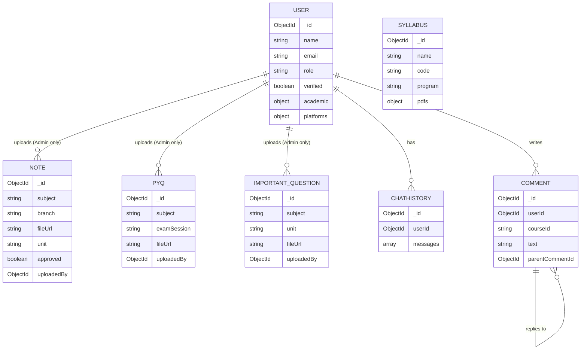
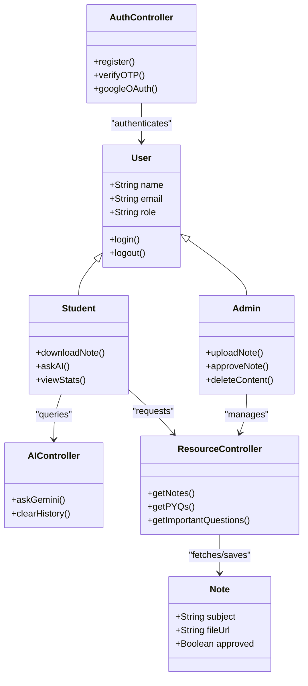
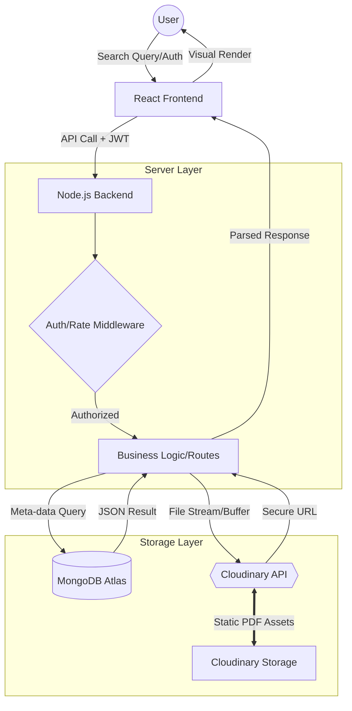

# Project Report: Learnify - A Full-Stack Learning Management System

## 1 Introduction

### 1.1 Abstract
**Learnify** is a sophisticated, full-stack Learning Management System (LMS) engineered to revolutionize the way students interact with academic resources. In an era of rapid digital transformation, Learnify serves as a centralized hub that bridges the traditional gap between complex academic curriculums and accessible digital materials. Built on the robust **MERN (MongoDB, Express, React, Node.js)** stack, the platform provides a high-performance, scalable solution for managing diverse academic content such as lecture notes, syllabi, and previous year question papers. 

Beyond simple resource hosting, Learnify integrates advanced features including **Role-Based Access Control (RBAC)**, seamless **Google OAuth** authentication, and a cutting-edge **AI-powered academic assistant** powered by the **Google Gemini API**. This strategic combination of technologies ensures a secure, personalized, and interactive learning environment tailored to the modern student's needs.

### 1.2 Purpose
The primary objective of Learnify is to eliminate the fragmentation of academic resources that students often face. Frequently, students struggle to find verified, high-quality study materials across various unofficial groups and platforms. Learnify addresses this by:
- **Centralizing Resources**: Providing a single, verified source for all academic downloads including notes, PYQs, and important questions.
- **Enhancing Accessibility**: Ensuring that students can access these resources anytime, anywhere, on any device.
- **AI-Driven Support**: Offering 24/7 academic assistance through an integrated AI chatbot that can answer subject-specific queries and guide students through their syllabus.
- **Professional Growth**: Integrating technical profiles (GitHub/LeetCode) to help students build a comprehensive academic and professional portfolio.

### 1.3 Scope
The scope of the Learnify project encompasses the following key areas:
- **Comprehensive Authentication System**: Implementation of secure Login/Signup using JWT, email-based OTP verification for account security, and Google OAuth for user convenience.
- **Dynamic Resource Management**: A robust system for Admins and Teachers to upload, categorize, and approve academic notes and documents.
- **Advanced Academic Tracking**: Features for students to manage their academic profile, including branch-specific content filtering, semester tracking, and CGPA estimation.
- **Intelligent AI Integration**: A persistent AI chat interface that leverages Large Language Models (LLMs) to provide contextual academic help.
- **Portfolio Integration**: Automated fetching and display of GitHub repositories and LeetCode performance metrics to showcase technical skills.
- **Modern User Experience**: A highly responsive, visually appealing frontend built with Vite and Tailwind CSS, featuring smooth transitions with Framer Motion and support for system-wide Dark/Light modes.
- **Scalable Backend Architecture**: A secure RESTful API architecture designed to handle concurrent users and large file transfers efficiently.

### 1.4 Definition
- **LMS**: Learning Management System.
- **MERN**: MongoDB, Express.js, React.js, Node.js.
- **JWT**: JSON Web Token for secure authentication.
- **OTP**: One-Time Password for email verification.

### 1.5 Keyword
Academic Resource Management, Full-stack Development, MERN Stack, AI Assistant, Cloudinary Storage, Role-based Access, Education Tech.

### 1.6 Technology
- **Frontend**: React.js, Vite, Tailwind CSS, Framer Motion (animations).
- **Backend**: Node.js, Express.js.
- **Database**: MongoDB with Mongoose ODM.
- **Storage**: Cloudinary (for PDF and image hosting).
- **Security**: JWT, Helmet, Express-rate-limit, Bcryptjs.
- **AI**: Google Gemini API.
- **Email**: Nodemailer for OTP and notifications.

## 2 Requirement gathering analysis

### 2.1 Questionnaires
The requirement gathering phase involved a series of structured interviews and surveys with potential users (students and faculty). The key questions addressed were:
1. **Accessibility**: How can students access high-quality notes effortlessly without navigating through fragmented social media groups or outdated drive links?
2. **Quality Control**: What mechanisms can be implemented to ensure that only verified, accurate, and high-quality academic materials are available on the platform?
3. **Instant Assistance**: How can we provide immediate, 24/7 academic support for students who have doubts outside of classroom hours?
4. **Holistic Profiling**: How can the platform help students showcase their technical growth, such as GitHub projects and LeetCode rankings, alongside their academic performance?
5. **Usability**: What UI/UX features (like search, filtering, and dark mode) are essential for a modern student-centric application?

### 2.2 Feasibility Analysis

#### 2.2.1 Technical Feasibility
The project leverages the **MERN stack**, a mature and highly documented technology suite that provides excellent performance and scalability.
- **MongoDB** offers a flexible schema for varied academic content.
- **Node.js and Express** provide a non-blocking, event-driven backend capable of handling high concurrency.
- **React.js** enables the creation of a dynamic, single-page application (SPA) with a rich user interface.
- **Cloudinary integration** provides a reliable, cloud-based solution for storage and delivery of heavy PDF documents.
- **Google Gemini API** ensures that the AI assistant is powered by state-of-the-art LLM capabilities.
Given the existing expertise and the wealth of community support for these technologies, the project is highly feasible technically.

#### 2.2.2 Economical Feasibility
Learnify is designed to be highly cost-effective, especially during its initial phases:
- **Open-Source Stack**: All core technologies (MongoDB, Express, React, Node) are open-source and free to use.
- **Free-Tier Utilization**: The project utilizes the generous free tiers of cloud services such as MongoDB Atlas, Cloudinary, and the Google Gemini API (for development).
- **Maintenance**: The modular architecture ensures that future maintenance costs are kept to a minimum as components can be updated independently.

#### 2.2.3 Operational Feasibility
The system is designed with a low learning curve for both students and administrators. Students can easily navigate the resource dashboard, while the admin panel provides intuitive tools for document approval and user management. The integration of Google OAuth further lowers the entry barrier for new users.

### 2.3 Hardware Requirement
The following hardware specifications are recommended for optimal performance of both the development environment and the client-side application:
- **Processor**: Intel Core i3 (10th Gen) or AMD Ryzen 3 3000 series (minimum); i5/Ryzen 5 or higher recommended.
- **RAM**: 8GB (minimum) to comfortably run the development server and multiple browser tabs.
- **Storage**: At least 1GB of free disk space for the project repository, node_modules, and local assets.
- **Display**: A screen resolution of 1366x768 or higher is recommended for the developer and end-user interface.
- **Network**: Stable broadband internet connection (at least 5 Mbps) for cloud database connectivity and AI services.

### 2.4 Software Requirement
The system requires the following software environment for development and production:
- **Operating System**: Windows 10/11, macOS Monterey+, or a modern Linux distribution (Ubuntu 20.04+).
- **Runtime Environment**: Node.js v18.x or later (LTS recommended) and npm v9.x+.
- **Database**: MongoDB Atlas account for cloud storage or MongoDB Community Server 6.0+ for local development.
- **Web Browser**: Modern Chromium-based browsers (Chrome, Edge) or Firefox for full compatibility with React features.
- **Version Control**: Git for source code management.
- **Code Editor**: Visual Studio Code with recommended extensions (ESLint, Prettier).
- **Additional Tools**: Postman or Insomnia for API testing.

## 3 Design

### 3.1 Database design
The database architecture for Learnify is built using **MongoDB**, a NoSQL database that excels in handling unstructured and semi-structured data. The choice of MongoDB was driven by the need for a flexible schema that can accommodate various types of academic resources (PDFs, images, text) without the rigidity of traditional relational tables.
- **Users Collection**: Stores comprehensive user profiles, including encrypted passwords (using Bcryptjs), Google OAuth identifiers, academic details (branch, semester, CGPA), and dynamic stats from GitHub and LeetCode.
- **Notes Collection**: A centralized repository for document metadata. Each entry includes subject names, unit descriptions, semester-wise categorization, and secure Cloudinary URLs for the actual file storage.
- **ChatHistory**: Implements a persistent messaging schema that allows users to revisit their AI assistant interactions across different sessions.
- **Syllabus & PYQs**: Specialized collections for exam-centric materials, allowing for efficient querying based on academic years and exam sessions.

### 3.1.1 Data dictionary
| Field Name | Data Type | Description |
|------------|-----------|-------------|
| _id | ObjectId | Unique identifier generated by MongoDB |
| name | String | Full name of the user for profile display |
| email | String | Primary identifier for auth and notifications |
| role | Enum | Defines permissions (student, teacher, admin) |
| verified | Boolean | Flag for email OTP verification status |
| fileUrl | String | Secure HTTPS link to Cloudinary assets |
| academic | Object | Nested object containing Branch, Semester, etc. |

### 3.2 Use Case Diagram
The Use Case diagram outlines the primary interactions between various actors and the system functionalities.

```mermaid
useCaseDiagram
    actor "Student" as S
    actor "Admin" as A
    actor "Guest" as G

    package Learnify {
        usecase "Login / Sign Up" as UC1
        usecase "Download Notes" as UC2
        usecase "Upload Notes" as UC3
        usecase "Manage Users" as UC4
        usecase "Upload PYQs" as UC5
        usecase "Upload Important Questions" as UC6
        usecase "Interact with AI Assistant" as UC7
        usecase "View Personal Stats" as UC8
    }

    G --> UC1    
    S --> UC1
    S --> UC2
    S --> UC7
    S --> UC8
    A --> UC1
    A --> UC2
    A --> UC3
    A --> UC4
    A --> UC5
    A --> UC6
```

### 3.3 E-R diagram
The Entity-Relationship diagram illustrates the logical connections between users and the academic resources they interact with.



### 3.4 Class Diagram
The Class diagram represents the high-level system components and their functional responsibilities.



### 3.5 Data Flow diagram
The DFD shows how data traverses from the user interface through the security layer to the final storage persistence.



## 4 Implementation Details

### 4.1 Authentication & Security
- **JWT Implementation**: The system uses JSON Web Tokens for stateless authentication. Upon successful login, a token is issued and stored in a secure, HTTP-only cookie to prevent XSS attacks.
- **Google OAuth**: Integrated using the `google-auth-library`, allowing users to sign in with their academic Google accounts.
- **Email Verification**: A custom OTP system using `Nodemailer` ensures that all registered student accounts are verified before they can access premium resources.
- **Middleware Security**: The backend is hardened using `Helmet` for secure headers, `CORS` for cross-origin management, and `express-rate-limit` to prevent brute-force attacks.

### 4.2 File Management & Cloudinary
- **Storage Strategy**: Large binary files (PDFs) are never stored in the database. Instead, they are streamed directly to **Cloudinary** using its Node.js SDK.
- **Metadata Association**: After a successful upload, Cloudinary returns a secure URL and a public ID, which are then saved in the MongoDB `Notes` collection alongside the uploader's metadata.
- **Optimized Delivery**: Files are served through Cloudinary's Content Delivery Network (CDN), ensuring fast download speeds regardless of the user's location.

### 4.3 AI Assistant (Gemini Integration)
- **Model Selection**: The assistant utilizes the `gemini-1.5-flash` model for high-speed, cost-effective academic responses.
- **Context Awareness**: The AI is programmed with a systemic prompt that constrains it to academic topics, ensuring it provides relevant study help.
- **History Persistence**: Conversations are stored in the database, allowing for long-running academic support sessions where the AI "remembers" previous queries.

### 4.4 External Platform Integration
- **GitHub API**: Fetches repository counts, total commits, and top languages used by the student to populate their professional portfolio section.
- **LeetCode Integration**: (Simulated/Scraped depending on API availability) Displays the student's problem-solving stats and ranking to encourage competitive programming.

## 5 Testing & Quality Assurance

### 5.1 Unit Testing
- Focuses on validating individual backend routes and Mongoose models.
- Tests include user registration logic, OTP generation, and note metadata validation.

### 5.2 Integration Testing
- Ensures that the React frontend correctly communicates with the Node.js API.
- Validates the complete flow from "Login" to "Download Resource," ensuring JWT tokens are correctly attached to headers and handled by middlewares.

### 5.3 UI/UX & Responsive Testing
- **Cross-Browser Verification**: Ensuring consistent styling across Chrome, Firefox, and Safari.
- **Responsiveness**: Testing with Chrome DevTools to ensure the grid layouts and interactive AI chat work flawlessly on mobile, tablet, and desktop screens.
- **Performance Audit**: Using Lighthouse to maintain high scores for Accessibility, Best Practices, and SEO.

## 6 Snapshot
*(Screenshots can be found in the `/Screenshot` directory of the project root)*
These snapshots cover:
- Student Dashboard with portfolio stats.
- Resource Gallery with branch-wise filtering.
- AI Assistant Chat interface.
- Admin Panel for note verification.

## 7 Conclusion
Learnify has evolved from a simple resource site into a comprehensive, AI-enhanced educational ecosystem. By leveraging the MERN stack and state-of-the-art cloud services, the project successfully addresses the critical need for centralized, verified, and accessible academic content. The inclusion of professional stats (GitHub/LeetCode) further motivates students to bridge the gap between their curriculum and real-world technical skills.

## 8 Limitation
- **Format Constraints**: Currently restricted to PDF and common image formats; support for video or interactive documents is pending.
- **API Dependencies**: The speed and availability of the AI assistant are bound by Google's Gemini API uptime.
- **Real-time Collaboration**: The system lacks real-time peer-to-peer discussion or live document editing features.

## 9 Future Enhancement
- **Automated Summarization**: Implementing AI logic to generate one-page summaries of uploaded research papers or long notes.
- **Peer-to-Peer Forums**: A specialized community section where students can discuss subject-specific problems.
- **Mobile Ecosystem**: Development of a companion mobile app using **React Native** for on-the-go academic access.
- **Live Lectures**: Integration of WebRTC or third-party meeting APIs for live tutoring sessions.

## 10 Reference
- [React Documentation](https://reactjs.org/)
- [Express.js Guide](https://expressjs.com/)
- [MongoDB Manual](https://www.mongodb.com/docs/)
- [Cloudinary API Documentation](https://cloudinary.com/documentation)
- [Gemini AI API](https://ai.google.dev/)
- [MERN Stack Tutorial (MongoDB University)](https://university.mongodb.com/)
